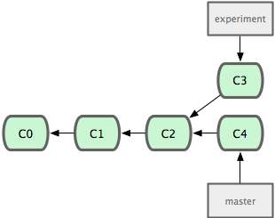
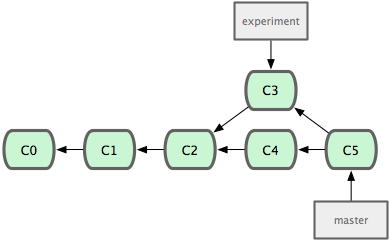
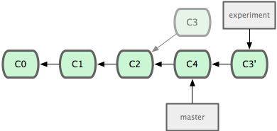
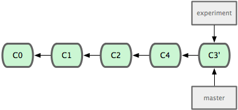
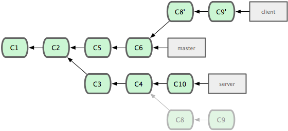

In Git, there are two main ways to integrate changes from one branch into
another - the 'merge' and the 'rebase'.  In this section we will learn what
'rebasing' is, how to do it and in what cases it may not be a good idea to.

### the basic rebase ###

If we go back to an earlier example from the Merge chapter, we can
see that we diverged our work and made commits on two different branches.  

The easiest way to integrate them, which we've already covered, is the _merge_ command.
This performs a 3-way merge between the two latest branch snapshots (C3 and C4) and the
most recent common ancestor of the two (C2), creating a new snapshot (and commit).

However, there is another way, which is to take the patch that was introduced 
in C3 and re-apply it on top of C4.  In Git, this is called _rebasing_ - with
the 'rebase' command, you can take all of the changes that were committed on
one branch and replay them on another one.  

In this example, we would run this:

	$ git checkout experiment
	$ git rebase master
	First, rewinding head to replay your work on top of it...
	Applying: added staged command

It works by going to the common ancestor of the two branches (the one you are
on and the one you are rebasing onto), getting the diff introduced by each
commit of the branch you are on, saving them to temporary files, then moving
the branch over to the rebasing branch and applying each change in turn.

At this point, you can go back to the master branch and do a fast-forward merge.

Now the snapshot pointed to by C3' is exactly the same as the one that was
pointed to by C5 in the 'merge' example, so there is not really any difference
in the end product of the integration, but it does make for a cleaner history.

If you look at the log of a rebased branch, it just looks like a linear history,
like all of the work happened in series, even when it actually happened in 
parallel.  

Often one will do this to make sure that commits they did will apply
cleanly on a remote branch, maybe to a project they are trying to contribute to
that they are not the maintainer of.  In this case, the contributor would do 
thier work in a branch, then rebase thier work onto 'origin/master' when they
are ready to submit thier patches to the main project so the maintainer doesn't
have to do any integration work, it'll just be a fast forward or a clean apply.

### more interesting rebases ###

You can also have your rebase replay on something other than the rebase branch.
Let's take a history like this, for example.  We branched a topic branch ('server'), 
say to add some server-side functionality to our project and made a few commits.  Then
we branched off of that to make the client side changes ('client') and committed
a few times. 

Then we decide that we want to merge our client side changes into
our mainline for a release but we want to hold off on the server side changes
until it is further tested.  We can take the changes on 'client' that are not
on 'server' and replay them on our master branch by using the **--onto** option
to 'git rebase'.

	$ git rebase --onto master server client

This basically says "checkout the 'client' branch, figure out the patches from 
the common ancestor of it and the 'server' branch, then replay them onto master". 
A bit complex, but the result is pretty cool.

Now we can simply fast-forward our master branch.

	$ git checkout master
	$ git merge client

Boom.  We roll the release out off of our 'master' branch.  A bit later we get 
our results from the field and it is concluded that the 'server' changes are 
working well and should be rolled in.  We can either merge in the 'server'
branch or we can rebase it in.

The we can rebase the server branch onto the master branch without having to 
check it out first by running 'git rebase (base branch) (work branch)' - which
will check out the _work branch_ (server) for you and replay it onto 
the _base branch_ (master).  

	$ git rebase master server

Then you can just fast forward the _base branch_ (master).

	$ git checkout master
	$ git merge server

Now we can remove the 'client' and 'server' branches because all the work is 
integrated and we don't really need them anymore.

	$ git branch -d client
	$ git branch -d server
	

### the perils of rebasing ###

Ahh, but the bliss of rebasing is not without its drawbacks.  It can be summed
up in a single line:

## "do not rebase commits that you have pushed to a public repository" ##

If you follow that, you'll be cool.  If you do not, people will hate you and 
you will be scorned by friends and family. 

When you rebase stuff, you are 
abandoning existing commits and creating new ones that are similar but still
different.  That means that if you push commits somewhere that others can pull
them down and base work off of them, then you rewrite those commits and push them
up again, you collaborators will have to re-merge their work again and things
will get messy when you try to pull thier work back into yours.

If you treat rebase as a way to clean up and work with commits _before_ you 
push them, and only ever rebase commits that have never been available publicly,
then you'll be living the sweet life.

  <a href="undoing.html" class="page-prev">&laquo; Undoing</a><a href="tagging.html" class="page-next">Tagging &raquo;</a>

